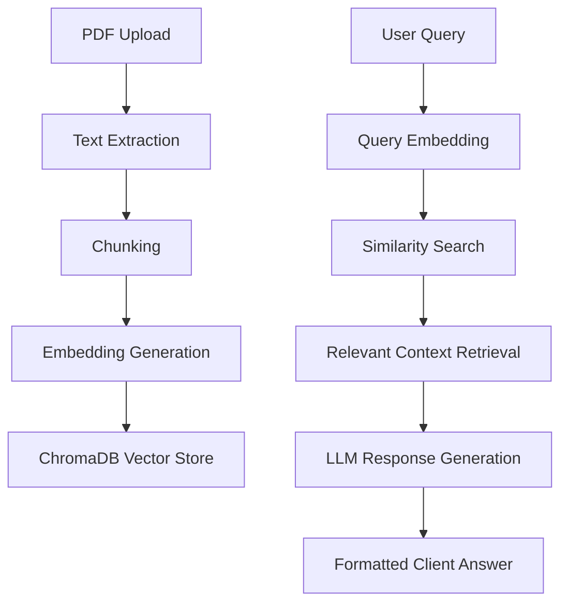

# Ragify 🚀

Turn static documents into intelligent conversations.

Ragify is an AI-powered Retrieval-Augmented Generation (RAG) platform that allows users to upload PDF documents and interact with them through natural language conversations.

The system extracts text from PDFs, generates semantic embeddings, stores them in a vector database, retrieves relevant context, and generates intelligent responses using Google Gemini Large Language Models.

---

## Features

- 📄 **Upload & Process PDFs**: Instantly extract text and chunk it.
- 🔍 **Semantic Document Search**: Multi-dimensional semantic matching using sentence-transformers.
- ⚡ **AI-Powered Answers**: Highly contextual, precise responses with receipts, powered by Google Gemini.
- 📦 **ChromaDB Vector Storage**: High-performance, embedded vector database.
- 🚀 **Render Cold Start Waking**: Automated API health check pings on client landing load to eliminate cold start wait times.
- 🎨 **Premium Glassmorphic UI**: Sleek dark mode design with cinematic micro-animations and smooth gsap layout transitions.

---

## Architecture



---

## Directory Structure

```
ragify/
├── backend/
│   ├── app.py             # FastAPI Server Entrypoint
│   ├── rag.py             # RAG Engine (Embeddings + Vector DB + Gemini LLM)
│   ├── requirements.txt   # Python Dependencies
│   ├── .env.example       # Backend Env Configuration
│   └── uploads/           # Temp storage for uploaded PDFs
├── client/
│   ├── src/               # React + TS Codebase
│   ├── index.html         # Client Shell
│   ├── package.json       # Node Dependencies
│   └── .env.example       # Client Env Configuration
```

---

## Environment Variables Configuration

Both the backend and client-side applications configure their behaviors via environment files.

### 1. Backend Config (`backend/.env`)
Create a file named `.env` in the `backend/` directory:
```env
# Google Gemini API Key (Generate one here: https://aistudio.google.com/)
GEMINI_API_KEY=your_gemini_api_key_here

# Server Bind Configuration (Defaults: HOST=0.0.0.0, PORT=8000)
HOST=0.0.0.0
PORT=8000

# Allowed CORS Origins (Comma-separated. Defaults to "*")
CORS_ORIGINS=http://localhost:5173,http://localhost:80
```

### 2. Client Config (`client/.env`)
Create a file named `.env` in the `client/` directory:
```env
# The URL pointing to your backend API
VITE_API_BASE_URL=http://localhost:8000
```

---

## Getting Started (Local Development)

### 1. Run the Backend
Ensure you have Python 3.10+ installed.

```bash
cd backend
# Create virtual environment
python -m venv venv
source venv/bin/activate  # On Windows: venv\Scripts\activate

# Install dependencies
pip install -r requirements.txt

# Create .env from template
cp .env.example .env
# Edit .env and enter your GEMINI_API_KEY

# Start the server
python app.py
```
The FastAPI documentation will be available at `http://localhost:8000/docs`.

### 2. Run the Client
Ensure you have Node.js 18+ installed.

```bash
cd client
# Install packages
npm install

# Create .env from template
cp .env.example .env

# Run development server
npm run dev
```
The client dashboard will be available at `http://localhost:5173`.

---

## Cloud Deployment Guides

### 1. Deploying the Backend (FastAPI)

#### **Option A: Render.com (Recommended)**
1. Sign up/log in to [Render](https://render.com/).
2. Click **New +** and select **Web Service**.
3. Connect your Ragify Git repository.
4. Set the following settings:
   - **Root Directory**: `backend`
   - **Runtime**: `Python`
   - **Build Command**: `pip install -r requirements.txt`
   - **Start Command**: `python app.py` (or `uvicorn app:app --host 0.0.0.0 --port $PORT`)
5. Under **Environment Variables**, add:
   - `GEMINI_API_KEY` = `<your_real_gemini_api_key>`
   - `PORT` = `8000` (Render will automatically bind and map this)
6. Deploy! Render will build the virtual environment, install requirements, and serve it at a public HTTPS URL (e.g., `https://ragify-backend.onrender.com`).

#### **Option B: Railway.app**
1. Create a new project in [Railway](https://railway.app/).
2. Select **Deploy from GitHub repo** and connect your repository.
3. In the service settings:
   - Set **Root Directory** to `/backend`.
   - Set the start command to `uvicorn app:app --host 0.0.0.0 --port $PORT`.
4. In the **Variables** tab, add:
   - `GEMINI_API_KEY` = `<your_real_gemini_api_key>`
5. Under **Settings**, click **Generate Domain** to get a public URL.

---

### 2. Deploying the Frontend (React/Vite)

#### **Option A: Vercel or Netlify (Quickest)**
1. Connect your repository to Vercel/Netlify.
2. Select the `client` directory as the **Root Directory**.
3. Set the build settings as:
   - **Build Command**: `npm run build`
   - **Output Directory**: `dist`
4. Under **Environment Variables**, add:
   - `VITE_API_BASE_URL` = `<your_deployed_backend_url>` (e.g., `https://ragify-backend.onrender.com`)
5. Deploy! Vercel/Netlify will host your statically optimized, high-speed single page application.

---

## Security & Best Practices
- **API Keys**: Never commit your `.env` files to git. They are listed in `.gitignore` by default.
- **CORS Configuration**: Restrict the `CORS_ORIGINS` in your production backend environment to only match your deployed client domain.